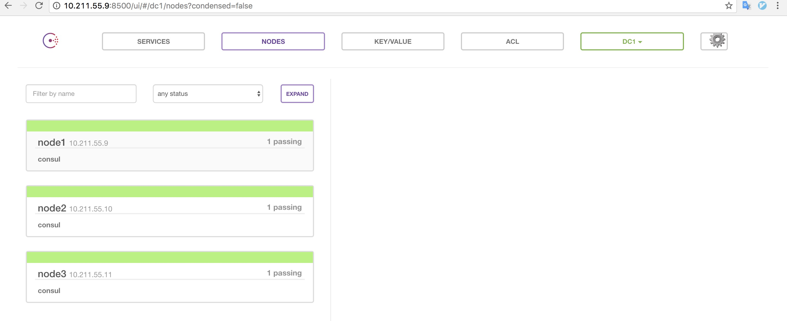
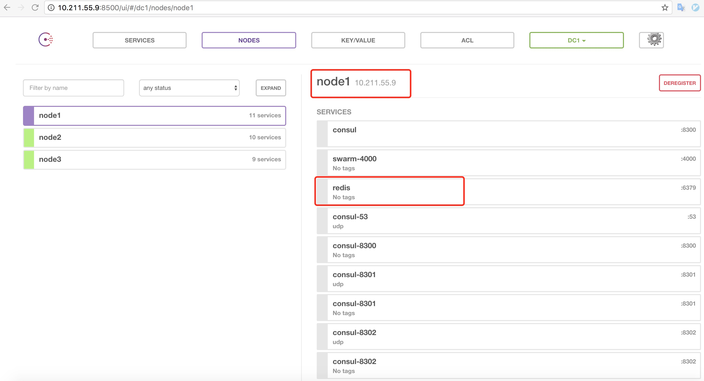

#Consul集群搭建
> console是一个开源的docker swarm集群服务发现平台
> 搭建简单使用方便

## 环境说明
 
#### 虚拟机
>ubuntu-16.04.2-server-amd64

    ubuntu1: 10.211.55.9

    ubuntu2: 10.211.55.10

    ubuntu3: 10.211.55.11
    
#### 拉取镜像

    sudo docker pull progrium/consul
    
## 启动容器
> 其中172.17.0.1是docker0的默认ip，可以通过ip addr命令查看docker0的网络信息得到

* ubuntu1

        sudo docker run -d -h node1 -v /mnt:/data \
            -p 10.211.55.9:8300:8300 \
            -p 10.211.55.9:8301:8301 \
            -p 10.211.55.9:8301:8301/udp \
            -p 10.211.55.9:8302:8302 \
            -p 10.211.55.9:8302:8302/udp \
            -p 10.211.55.9:8400:8400 \
            -p 10.211.55.9:8500:8500 \
            -p 172.17.0.1:53:53/udp \
            progrium/consul -server -advertise 10.211.55.9 -bootstrap-expect 3
        
* ubuntu2

    
        sudo docker run -d -h node2 -v /mnt:/data  \
            -p 10.211.55.10:8300:8300 \
            -p 10.211.55.10:8301:8301 \
            -p 10.211.55.10:8301:8301/udp \
            -p 10.211.55.10:8302:8302 \
            -p 10.211.55.10:8302:8302/udp \
            -p 10.211.55.10:8400:8400 \
            -p 10.211.55.10:8500:8500 \
            -p 172.17.0.1:53:53/udp \
            progrium/consul -server -advertise 10.211.55.10 -join 10.211.55.9
        
        
* ubuntu3

        sudo docker run -d -h node3 -v /mnt:/data  \
            -p 10.211.55.11:8300:8300 \
            -p 10.211.55.11:8301:8301 \
            -p 10.211.55.11:8301:8301/udp \
            -p 10.211.55.11:8302:8302 \
            -p 10.211.55.11:8302:8302/udp \
            -p 10.211.55.11:8400:8400 \
            -p 10.211.55.11:8500:8500 \
            -p 172.17.0.1:53:53/udp \
            progrium/consul -server -advertise 10.211.55.11 -join 10.211.55.9
        
        
## 检查UI

浏览器中访问 `http://10.211.55.9:8500`, 返回如下:

## 服务注册
默认情况下，自己的应用服务是无法直接注册到consul中的，使用`gliderlabs/registrator`镜像完成应用的自动注册和注销

### 使用gliderlabs/registrator
> 注意，gliderlabs/registrator默认只主动注册映射过端口的应用，如果应用为映射端口到主机，则无法在consul上发现这个服务

#### 在各个节点运行服务

ubuntu1 机器

	sudo docker run -d \
    --name=registrator \
    --net=host \
    --volume=/var/run/docker.sock:/tmp/docker.sock \
    gliderlabs/registrator:latest \
      consul://10.211.55.9:8500
      
ubuntu2 机器

	sudo docker run -d \
	    --name=registrator \
	    --net=host \
	    --volume=/var/run/docker.sock:/tmp/docker.sock \
	    gliderlabs/registrator:latest \
	      consul://10.211.55.10:8500
	
ubuntu3 机器

	sudo docker run -d \
	    --name=registrator \
	    --net=host \
	    --volume=/var/run/docker.sock:/tmp/docker.sock \
	    gliderlabs/registrator:latest \
	      consul://10.211.55.11:8500
	      
#### 测试服务

	docker -H 10.211.55.9 run -d -p 6379:6379 redis
	
可以在consul UI中看到新启动的服务
