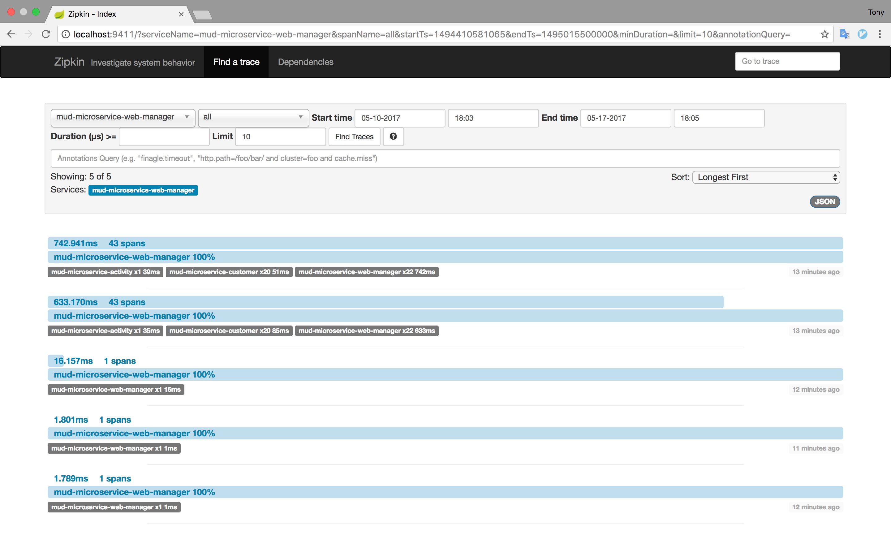

# zipkin支持
> 配合spring sleuth，完成对服务的性能的监控
> 配合elasticsearch保证监控数据的持久化

## 服务端

### maven依赖

    <dependency>
        <groupId>org.springframework.cloud</groupId>
        <artifactId>spring-cloud-starter-eureka</artifactId>
    </dependency>
    <dependency>
        <groupId>io.zipkin.java</groupId>
        <artifactId>zipkin-autoconfigure-ui</artifactId>
    </dependency>
    <dependency>
        <groupId>io.zipkin.java</groupId>
        <artifactId>zipkin-server</artifactId>
    </dependency>
    <dependency>
        <groupId>io.zipkin.java</groupId>
        <artifactId>zipkin-autoconfigure-storage-elasticsearch-http</artifactId>
        <version>1.16.2</version>
    </dependency>
    
### application.yml持久化监控数据配置

    zipkin:
      storage:
        type: elasticsearch
        elasticsearch:
          cluster: elasticsearch
          hosts: http://localhost:9200
          index: zipkin
          index-shards: 5
          index-replicas: 1
          
## 客户端

### maven依赖

    <dependency>
        <groupId>org.springframework.cloud</groupId>
        <artifactId>spring-cloud-starter-sleuth</artifactId>
    </dependency>
    <dependency>
        <groupId>org.springframework.cloud</groupId>
        <artifactId>spring-cloud-sleuth-zipkin</artifactId>
    </dependency>

### application.yml配置

    spring:
      zipkin:
        base-url: http://localhost:9411
      sleuth:
        sampler:
          percentage: 1
          
## 访问监控界面

    